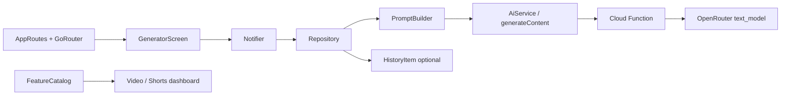

# New Tools Architecture (Hook · Chapters · Captions)

**Status:** Implemented (client + VALID_FEATURES). Deploy `generateContent` if not yet live.  
**Scope:** 3 new text generators, same stack as Title Generator  
**Billing / Play IAP:** out of scope

---

## Goal

Grow Tubora from “SEO helpers” into a fuller creator toolkit:

| Tool | Best for | User input | Output |
|------|----------|------------|--------|
| **Hook Generator** | Shorts (+ Video) | Topic, tone, language, format | 10–15 opening hooks (first 3s) |
| **Chapter / Timestamps** | Video (long-form) | Topic or rough outline, duration | Timestamped chapters list |
| **Caption / On-screen Text** | Shorts | Topic + script snippet (optional) | Short overlay captions / text shots |

---

## Existing pattern (do not invent a new stack)

```
Screen → Provider → Repository → PromptBuilder
                              → AiService.generate (Cloud Function generateContent)
                              → Model.fromJson
                              → optional History save
```

Reference feature: `lib/features/title/`

Video vs Shorts today = **same tools**, different `ContentFormat` via `selectedFormatProvider`. New tools follow the same rule; catalog copy can hint “best for Shorts/Video” in subtitle.

---

## System flow



---

## Feature IDs (contract)

Must match across client + backend:

| Tool | `AiFeature` / `VALID_FEATURES` id | Suggested HistoryType |
|------|----------------------------------|------------------------|
| Hook Generator | `hook` | `HistoryType.hook` |
| Chapters | `chapters` | `HistoryType.chapters` |
| Captions | `captions` | `HistoryType.captions` |

Quota: same as others — server `PLAN_LIMITS` (free 1/day per feature, pro 50). Client `AiFeature.dailyLimit` is display-only / unused for enforcement.

---

## Per-tool folder layout

### 1. Hook — `lib/features/hook/`

```
hook/
  models/generated_hook.dart          # { hooks: List<String>, tip?: String }
  repository/hook_prompt_builder.dart
  repository/hook_repository.dart
  providers/hook_provider.dart
  screens/hook_generator_screen.dart
```

**JSON schema (server response):**
```json
{ "hooks": ["string", "..."], "styleTips": ["string"] }
```

**Prompt inputs:** topic, language, tone (optional), `ContentFormat` (shorts vs longForm)  
**maxTokens:** ~600  
**UI:** topic field + suggestions + language + generate → list with copy-all / copy-one

---

### 2. Chapters — `lib/features/chapters/`

```
chapters/
  models/generated_chapters.dart      # { chapters: [{ time, title }] }
  repository/chapters_prompt_builder.dart
  repository/chapters_repository.dart
  providers/chapters_provider.dart
  screens/chapters_generator_screen.dart
```

**JSON schema:**
```json
{
  "chapters": [
    { "time": "0:00", "title": "Intro" }
  ],
  "descriptionBlock": "0:00 Intro\n1:20 ..."
}
```

**Prompt inputs:** topic (or paste outline), optional video length (e.g. 8 / 12 / 20 min), language  
**maxTokens:** ~800  
**UI:** topic + duration dropdown + generate → list + “Copy for YouTube description” (uses `descriptionBlock`)

---

### 3. Captions — `lib/features/captions/`

```
captions/
  models/generated_captions.dart      # { captions: [{ text, mood? }] }
  repository/captions_prompt_builder.dart
  repository/captions_repository.dart
  providers/captions_provider.dart
  screens/captions_generator_screen.dart
```

**JSON schema:**
```json
{
  "captions": [
    { "text": "Wait for it...", "beats": "hook" }
  ]
}
```

**Prompt inputs:** topic, optional short script/context, language, format=shorts bias  
**maxTokens:** ~500  
**UI:** topic + optional context field + generate → short lines (good for CapCut / on-screen)

---

## Shared wiring (every new tool)

| Layer | File | Change |
|-------|------|--------|
| AI enum | `lib/core/services/ai/models.dart` | Add `AiFeature.hook` / `.chapters` / `.captions` |
| Backend allowlist | `functions/src/utils.js` → `VALID_FEATURES` | Same string ids |
| Routes | `lib/core/router/routes.dart` | Path constants |
| Router | `lib/core/router/app_router.dart` | `GoRoute` → screen |
| Home grid | `lib/features/home/models/feature_catalog.dart` | `FeatureItem` + section |
| History enum | `lib/features/history/models/history_item.dart` | New `HistoryType` + Hive field |
| Hive regen | `history_item.g.dart` | `build_runner` |
| History UI | `history_type_meta.dart`, `history_detail_screen.dart` | Label, icon, detail case |

**No changes needed** to `CloudFunctionsAiService` transport for standard text tools.

**Deploy:** `firebase deploy --only functions` after `VALID_FEATURES` update (or next functions deploy).

---

## Catalog placement (UX)

Suggested home sections (both Video + Shorts tabs share catalog):

| Tool | Section | Subtitle hint |
|------|---------|----------------|
| Hook Generator | **Create** (after Title) or **Content** | “First 3-second openers” |
| Caption / On-screen | **Create** or **Content** | “Text overlays for Shorts” |
| Chapters | **Grow** or **Content** | “YouTube timestamps” |

Recommendation:

- **Create:** Thumbnail, Title, Description, Hashtag, **Hook**, **Captions**
- **Grow:** SEO, Trending, **Chapters** (Video-oriented but still useful if user pastes Shorts outline)
- **Content:** Script, Viral Ideas  

Avoid putting all three in Create only — grid gets crowded. Prefer:

- Hook → Create  
- Captions → Content  
- Chapters → Grow  

---

## Format awareness

Reuse `selectedFormatProvider` / `ContentFormat` like other generators:

- **Hook / Captions:** prompt bias Shorts (punchy, vertical) vs long-form cold open  
- **Chapters:** if format is Shorts, prompt can return fewer “beats” or a short disclaimer; still allow generate (don’t hard-block)

---

## Non-goals (v1)

- Separate Video-only vs Shorts-only catalogs (same grid is fine)
- Image generation for these tools
- New Cloud Function (reuse `generateContent`)
- Play Billing / Pro-only lock on these tools
- Streaming responses

---

## Build order (recommended)

1. **Hook** — highest Shorts demand, simplest list UI (clone Title)  
2. **Captions** — same list pattern, slightly richer model  
3. **Chapters** — structured list + copy-description block  

Each tool is independently shippable after its wiring + one functions deploy for allowlist.

---

## Success criteria

- [ ] Each tool appears on Video + Shorts dashboards  
- [ ] Generate returns structured JSON; empty/error/loading match existing generators  
- [ ] Save to History works with correct type  
- [ ] Free quota = 1/day per new feature id (server)  
- [ ] No new secrets or new callable names  

---

## How to start implementation

In Cursor:  
`Implement NEW_TOOLS_ARCHITECTURE.md — start with Hook Generator only`
